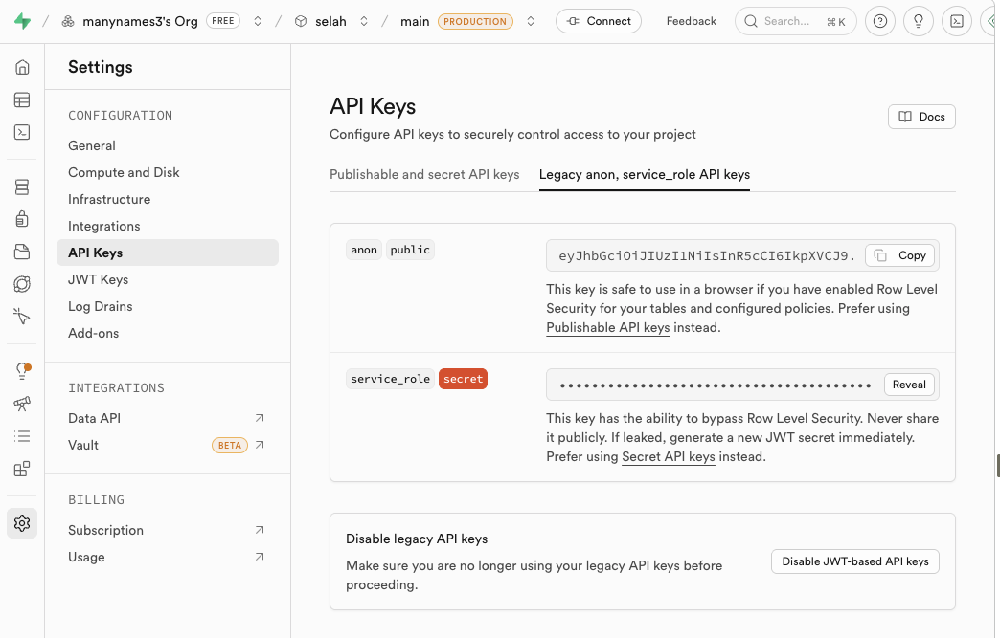
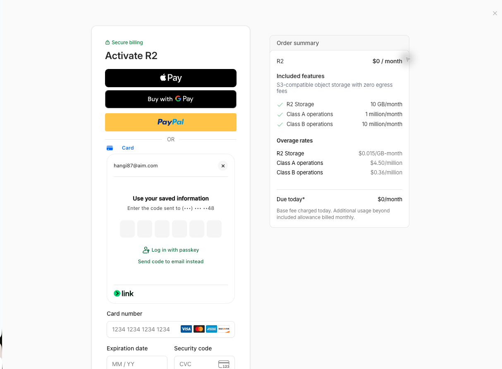

# SELAH

Daily devotional songwriting site: one song, one scripture, one archive.

This project is intentionally lightweight:
- one main frontend file: `index.html`
- Cloudflare Pages for static hosting
- Cloudflare Pages Functions for server-side helpers
- Cloudflare R2 for MP3 storage
- Supabase for devotional metadata and artwork storage

The UI uses a vinyl-player metaphor with:
- animated disc + tonearm
- waveform scrubbing
- lyrics modal
- archive list
- admin-gated upload flow

## Tech Stack

| Layer | Tooling |
| --- | --- |
| Frontend | Vanilla HTML, CSS, JavaScript |
| Client SDK | `@supabase/supabase-js` via CDN |
| MP3 artwork extraction | `jsmediatags` via CDN |
| Metadata store | Supabase Postgres |
| Artwork storage | Supabase Storage |
| Audio storage | Cloudflare R2 |
| Hosting | Cloudflare Pages |
| Server-side endpoints | Cloudflare Pages Functions |
| Config | `wrangler.jsonc` |
| Typography | Google Fonts (`Libre Baskerville`, `Bebas Neue`, `Nunito`) |

## Screenshots

### Supabase service role location

This screenshot shows where the `service_role` secret is located in the Supabase dashboard. That secret now belongs only in server-side Cloudflare configuration and should never be exposed in the frontend.



### Cloudflare R2 activation billing checkpoint

This screenshot captures the moment architecture decisions become financially real. Once you are entering your own card and authorizing your own spend, you naturally slow down and double-check assumptions: how storage is billed, what counts as an operation, what stays inside the free tier, and whether the system design avoids surprise costs. That pressure is useful. It reinforces careful architecture, cost awareness, and eliminating surprises before they happen.



## Project Structure

```text
.
├── functions/
│   └── api/
│       ├── delete-audio.js
│       ├── devotionals.js
│       └── upload-audio.js
├── screenshots/
│   ├── cloudflare-r2-activation-billing-checkpoint.png
│   └── supabase-service-role-location.png
├── index.html
├── README.md
└── wrangler.jsonc
```

## Current Architecture

Current app split:
- Supabase stores devotional metadata in the `devotionals` table
- Supabase Storage holds artwork
- Cloudflare R2 holds MP3 files
- Cloudflare Pages serves the static site
- Cloudflare Pages Functions handle:
  - archive proxy reads
  - audio upload into R2
  - audio deletion from R2

This is a deliberate hybrid architecture, not an accidental mix of services.

## Why Cloudflare

Cloudflare is the better fit for this project because:

- the site itself is mostly static
- the MP3 files are the largest assets in the app
- R2 is a better long-term home for audio than database-adjacent storage
- Pages static hosting is a better fit than Netlify for low-maintenance free usage
- Workers/Pages Functions keep the runtime small without forcing a framework rewrite

The goal here is not "use one vendor for everything."  
The goal is "put each workload on the tool that fits it best."

For this app, that means:
- Supabase for relational metadata + simple CRUD
- Cloudflare for delivery and binary media storage

## Why Not Keep Netlify

Netlify was workable early on, but it became a weak point for this project because:

- the site is simple enough that Netlify was not adding architectural leverage
- usage ceilings were easy to hit for a media-oriented project
- once R2 became the right place for MP3s, Cloudflare Pages + Functions became the more natural deployment target

Switching to Cloudflare keeps the app lightweight while reducing pressure on the hosting layer.

## What I Would Have Done On AWS

If I deployed this through AWS, I would likely have used:

- **S3** for static site files and/or MP3 storage
- **CloudFront** in front of the site and media
- **Lambda** + **API Gateway** for upload/delete/archive helper endpoints
- optionally **Route 53** for DNS
- Supabase could still remain as the metadata database, or I could replace it later with DynamoDB / RDS depending on how far I wanted to go

That AWS version would be valid, but it is not the best fit here.

### AWS Thought Process

AWS would make sense if the project needed:
- deeper infrastructure control
- a wider multi-service backend
- more enterprise-style deployment patterns
- tighter integration into an existing AWS-heavy stack

### Why I Am Not Choosing AWS Here

Cloudflare is a better fit for this project specifically because:

- the app is small and static-first
- the runtime needs are minimal
- R2 is a natural match for MP3 object storage
- the Cloudflare deployment model is simpler for long-lived hobby/portfolio use
- AWS free-tier economics are more time-bound and less comfortable for a "set it up and keep it around for years" project
- AWS would introduce more moving parts than this app actually needs

In short:
- AWS would be more configurable
- Cloudflare is more appropriate

That is the key tradeoff.

## Data Model

The app reads from a single `devotionals` table:

```sql
create table devotionals (
  id          uuid primary key default gen_random_uuid(),
  title       text not null,
  scripture   text,
  entry_date  date not null,
  lyrics      text,
  audio_url   text,
  art_url     text,
  created_at  timestamptz default now()
);
```

Recommended policies used by this project:

```sql
alter table devotionals enable row level security;

create policy "Public read" on devotionals
for select using (true);
```

Admin writes now go through Cloudflare Pages Functions with the Supabase service role. The browser should not have direct `anon` insert/delete access to the `devotionals` table anymore.

Supabase Storage bucket still used for artwork:
- `devotional-art`

Legacy audio bucket references may still exist in historical data or fallback logic:
- `devotional-audio`

## How Uploads Work

### Audio

Current MP3 upload flow:

1. user selects an audio file
2. frontend posts the file to Cloudflare Pages Function `/api/upload-audio`
3. the function verifies the admin session cookie
4. the function writes the object into R2 through a native bucket binding
5. if R2 is not enabled yet, it can fall back to Supabase Storage server-side
6. the function returns the public MP3 URL
7. frontend sends the final devotional row to `/api/admin-entry-create`

### Artwork

Current artwork flow:

1. artwork is extracted client-side from MP3 metadata using `jsmediatags`
2. extracted art is uploaded to Cloudflare Pages Function `/api/upload-art`
3. the function verifies the admin session cookie
4. the function uploads the image to Supabase Storage using the service role
5. frontend sends the returned `art_url` to `/api/admin-entry-create`

This keeps the heaviest storage class, audio, on R2 while keeping artwork in Supabase without exposing admin credentials in the browser.

## Admin Security

The admin password is no longer stored in `index.html`.

Current admin flow:

1. browser posts the password to `/api/admin-login`
2. the Pages Function compares it against the encrypted Cloudflare secret `ADMIN_PASSWORD`
3. on success, the function sets an `HttpOnly` admin session cookie
4. admin-only routes verify that cookie before allowing upload or delete actions

Admin routes:
- `/api/admin-login`
- `/api/admin-logout`
- `/api/admin-session`
- `/api/admin-entry-create`
- `/api/admin-entry-delete`
- `/api/upload-audio`
- `/api/upload-art`
- `/api/delete-audio`

## Archive Loading

The archive now prefers:

1. Cloudflare Pages Function `/api/devotionals`
2. direct Supabase REST read
3. direct Supabase client query

That fallback chain exists because browser-only first-load archive loading was intermittently unreliable in deployment. The server-side archive proxy removes that dependency on a fragile browser-to-Supabase path.

## Setup

### 1. Configure Supabase

Create a Supabase project and set up:
- the `devotionals` table
- public read policy
- storage bucket for artwork:
  - `devotional-art`
- optional legacy/fallback storage bucket for audio:
  - `devotional-audio`

For security, this app now expects:
- public `select` on `devotionals`
- no direct browser `insert` or `delete` on `devotionals`
- server-side writes through the Cloudflare Function layer using the service role

### 2. Configure the frontend

Open `index.html` and update the config block:

```js
const SUPABASE_URL = 'YOUR_SUPABASE_URL';
const SUPABASE_ANON = 'YOUR_SUPABASE_ANON_KEY';
```

The admin password is intentionally not configured in the frontend anymore.

### 3. Configure Cloudflare R2

Create an R2 bucket for MP3s.

You will bind that bucket to Cloudflare Pages Functions as:

```text
AUDIO_BUCKET
```

You also need a public delivery base URL for playback, via:
- a public bucket URL, or
- a custom domain in front of the bucket

### 4. Configure Cloudflare Pages environment variables

Set these in your Cloudflare Pages project:

```text
SUPABASE_URL
SUPABASE_ANON
SUPABASE_SERVICE_ROLE
ADMIN_PASSWORD
ADMIN_SESSION_SECRET
AUDIO_PUBLIC_BASE_URL
AUDIO_KEY_PREFIX
SUPABASE_ART_BUCKET
SUPABASE_AUDIO_BUCKET
SUPABASE_ART_KEY_PREFIX
```

Notes:
- `SUPABASE_SERVICE_ROLE` is required for server-side insert/delete and artwork upload
- `ADMIN_PASSWORD` is the real admin password and should be stored as an encrypted secret
- `ADMIN_SESSION_SECRET` signs the admin session cookie and should be different from the password
- `AUDIO_PUBLIC_BASE_URL` should be the public URL used for MP3 playback
- `AUDIO_KEY_PREFIX` is optional, for example `audio`
- `SUPABASE_ART_BUCKET` defaults to `devotional-art`
- `SUPABASE_AUDIO_BUCKET` defaults to `devotional-audio`
- `SUPABASE_ART_KEY_PREFIX` defaults to `art`
- bind `AUDIO_BUCKET` as an R2 bucket binding in Pages

### 5. Configure `wrangler.jsonc`

This repo includes:

```jsonc
{
  "name": "selah",
  "pages_build_output_dir": ".",
  "compatibility_date": "2026-04-24"
}
```

That is enough for a static Pages deployment with Functions. Bindings and secrets can be set in the Cloudflare dashboard.

## Deploy To Cloudflare Pages

### GitHub deploy

1. Push the repo to GitHub
2. In Cloudflare, create a new Pages project
3. Connect the GitHub repository
4. Build settings:
   - build command: leave blank
   - output directory: `.`
5. Add environment variables
6. Add the `AUDIO_BUCKET` R2 binding
7. Deploy

### What Cloudflare will serve

Static frontend:
- `/`

Pages Functions:
- `/api/devotionals`
- `/api/admin-login`
- `/api/admin-logout`
- `/api/admin-session`
- `/api/admin-entry-create`
- `/api/admin-entry-delete`
- `/api/upload-audio`
- `/api/upload-art`
- `/api/delete-audio`

## Thought Process

The project follows a few practical constraints:

### 1. Keep the app editable in one place

The main UX and playback logic live in one file so the app can evolve quickly without framework overhead.

### 2. Use animation where it reinforces playback state

The important motion is functional:
- disc spin = playback state
- waveform = seek/progress
- tonearm = playback progress

That means animation is tied to the actual audio element, not just decorative loops.

### 3. Separate metadata from media

Metadata and media age differently:
- metadata is relational and query-heavy
- media is storage/bandwidth-heavy

That is why Supabase remains the metadata system while R2 holds the MP3 files.

### 4. Minimize migration risk

This migration intentionally does **not**:
- replace Supabase
- rewrite the UI in a framework
- change the table schema

It only changes the hosting/runtime layer and the MP3 storage path.

That keeps the blast radius small.

## Troubleshooting Notes

### Archive stuck on "Loading songs..."

Root causes and fixes:
- browser-side archive loading was unreliable on initial load
- a visualizer init crash could stop later setup code from running
- direct client and REST reads needed a more resilient fallback chain

What changed:
- added a server-side archive proxy endpoint
- made archive loading use function -> REST -> client fallback
- guarded visualizer canvas access so init cannot break the rest of the app

### Tonearm moving the wrong direction

The original tonearm motion rotated away from the record instead of onto it. That was corrected, then replaced with a progress-driven tonearm model.

### Tonearm realism

The player now uses:
- a longer tonearm
- progress-based inward tracking across the song duration
- pause/resume behavior driven by actual audio state
- reset behavior on track change and restart

Current sweep:
- start angle: `9deg`
- end angle: `36deg`

Interpolation is linear from `audio.currentTime / audio.duration`.

### Waveform scrubbing

Waveform seeking was tightened so the scrubber uses the rendered waveform bounds and updates progress immediately after a seek.

## Recent Updates

- migrated hosting/runtime direction from Netlify to Cloudflare Pages
- replaced Netlify-specific helper endpoints with Cloudflare Pages Functions
- moved MP3 upload/delete handling to Cloudflare-native R2 bindings
- kept Supabase for metadata and artwork storage
- fixed first-load archive rendering
- fixed tonearm direction and moved to progress-driven tracking
- narrowed tonearm sweep to `9deg -> 36deg`
- lengthened the tonearm
- fixed waveform scrubbing behavior
- added volume control
- updated branding to `SELAH`
- simplified the waveform header
- changed the left transport control to `-15 REWIND`
- tightened spacing between song date, title, and key/scripture
- documented the Cloudflare architecture and the AWS alternative
- replaced the client-side admin password check with Cloudflare secret-backed session auth
- moved devotional create/delete and artwork upload behind protected Pages Functions

## Current UX Features

- vinyl-style player with animated disc
- progress-driven tonearm tracking
- waveform seek
- auto-advance to next song
- playback speed controls
- loop toggle
- lyrics modal
- volume slider + mute toggle
- archive summary and selected-song context
- admin gate for upload flow
- delete controls visible only in admin mode

## Operational Notes

- the admin password now lives in Cloudflare Secrets, not in the frontend bundle
- Supabase anon credentials are still used client-side for public reads only
- Cloudflare bindings/secrets should be configured in the Pages dashboard
- admin writes now depend on Cloudflare secrets and session cookies
- if R2 is not enabled yet, `/api/upload-audio` can fall back to Supabase audio storage server-side

## Next Steps

Practical next improvements:
- move remaining hardcoded Supabase config out of the frontend
- decide whether artwork should also move from Supabase Storage to R2
- split `index.html` into smaller modules if the project grows
- add end-to-end tests for archive load, upload, playback, and delete flows

## License

Personal project / portfolio-style usage unless you choose otherwise.
